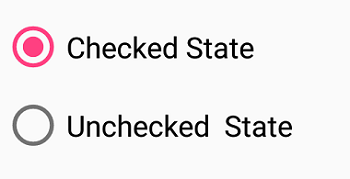
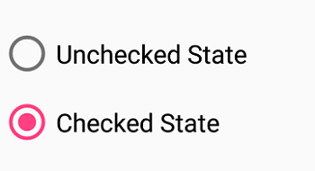

# Event in Xamarin Radio Button (SfRadioButton)
This is demo application for using event in Xamarin.Forms SfRadioButton control. The minimal set of required properties have been configured in this project to get started with SfRadioButton in Xamarin.Forms.

For more details please refer the Xamarin.Forms SfRadioButton UG documentation [Event in xamarin forms radiobutton](https://help.syncfusion.com/xamarin/radio-button/event) link.

## <a name="requirements-to-run-the-demo"></a>Requirements to run the demo ##

* [Visual Studio 2019 or Visual Studio 2017](https://visualstudio.microsoft.com/downloads/) or [Visual Studio for Mac](https://visualstudio.microsoft.com/vs/mac/).
* Xamarin add-ons for Visual Studio (available via the Visual Studio installer).

## <a name="troubleshooting"></a>Troubleshooting ##
### Path too long exception
If you are facing path too long exception when building this example project, close Visual Studio and rename the repository to short and build the project.

## <a name="description"></a>Description ##

### Initialize SfRadioButton and Event

Import the [`SfRadioButton`](https://help.syncfusion.com/cr/xamarin/Syncfusion.XForms.Buttons.SfRadioButton.html) namespace as shown below in your respective Page,

###### Xaml
```xaml
xmlns:buttons="clr-namespace:Syncfusion.XForms.Buttons;assembly=Syncfusion.Buttons.XForms"
```
###### C#
```C#
using Syncfusion.XForms.Buttons;
```
### StateChanged event

Occurs when the value(state) of the `IsChecked` property is changed by either touching the check box or setting the value to the `IsChecked` property using XAML or C# code. The event arguments are of type `StateChangedEventArgs` and expose the following property:

* `IsChecked`: The new value(state) of the `IsChecked` property.

###### Xaml
```xaml
<syncfusion:SfRadioGroup x:Name="radioGroup">
<syncfusion:SfRadioButton x:Name="check" Text="Checked State" IsChecked="True" StateChanged="RadioButton_StateChanged"/>
<syncfusion:SfRadioButton x:Name="uncheck" Text="Unchecked  State" StateChanged="RadioButton_StateChanged"/>
</syncfusion:SfRadioGroup>

private void RadioButton_StateChanged(object sender, StateChangedEventArgs e)
 {
    if (e.IsChecked.HasValue && e.IsChecked.Value)
    {
        (sender as SfRadioButton).Text = "Checked State";
    }
    else if (e.IsChecked.HasValue && !e.IsChecked.Value)
    {
        (sender as SfRadioButton).Text = "Unchecked State";
    }
 }
```
###### C#
```C#
SfRadioGroup radioGroup = new SfRadioGroup();
SfRadioButton check = new SfRadioButton();
check.Text = "Checked State";
check.IsChecked = true;
check.StateChanged += RadioButton_StateChanged;
SfRadioButton uncheck = new SfRadioButton();
uncheck.Text = "Unchecked State";
uncheck.StateChanged += RadioButton_StateChanged;
radioGroup.Children.Add(check);
radioGroup.Children.Add(uncheck);

private void RadioButton_StateChanged(object sender, StateChangedEventArgs e)
 {
    if (e.IsChecked.HasValue && e.IsChecked.Value)
    {
        (sender as SfRadioButton).Text = "Checked State";
    }
    else if (e.IsChecked.HasValue && !e.IsChecked.Value)
    {
        (sender as SfRadioButton).Text = "Unchecked State";
    }
 }
```

## <a name="output"></a>Output ##


